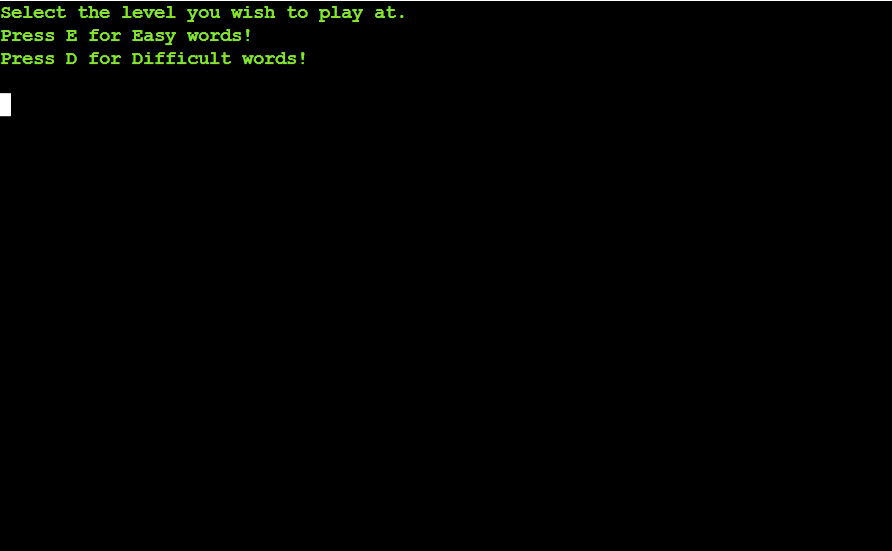

<h1 align="center">Hangman Game - Project Portfolio 3</h1>

---

# *Hangman Game*

Hangman is a word-guessing game where players attempt to unravel a hidden word by suggesting individual letters. Incorrect guesses result in the gradual formation of a hangman figure, while correct guesses reveal the letters' positions. 

The site can be accessed by this [link](https://hang-man-game55-2e55bd9f26a2.herokuapp.com/)

---

## How to play:
1. Click this *[link](https://hang-man-game55-2e55bd9f26a2.herokuapp.com/)* or copy this text: `https://hang-man-game55-2e55bd9f26a2.herokuapp.com/` and paste it in your browser's address bar.
1. As soon as the page is loaded, click 'RUN PROGRAM'.
1. Introduce yourself to the program.
1. Learn the rules.
1. Select the difficulty of words to play the game. 
1. After selecting the difficulty level, the game begins.
1. A secret word will be chosen, and its letters are represented by blank spaces.
1. Start guessing letters one by one. Each correct letter guess reveals its position in the word.
1. Be cautious! Incorrect letter guesses cost you one life.
1. You win if you correctly guess all the letters in the word before running out of lives. The hidden word will be revealed, and you'll emerge victorious!
1. If you lose all 6 lives before guessing the word, the hangman is fully hanged, and the game ends.

## User Stories

### First Time Visitor Goals:

* As a First Time Visitor to the Hangman game, my primary objective is to understand the game's concept and rules. I want to familiarize myself with the idea that I need to guess a hidden word by suggesting individual letters, while also comprehending the consequences of incorrect guesses.
* As a First Time Visitor, I want to see how many attempts I have left when playing.
* As a First Time Visitor, I want to choose the difficulty level, so I can tailor the game to my skill level.
* As a First Time Visitor, I want feedback after each guess, so I can adjust my strategy.
* As a First Time Visitor, I want the option to play again, so I can improve my skills and have another shot at winning.

### Returning Visitor Goals:

* As a Returning Visitor, I want to challenge myself with a different difficulty level, so I can experience varying levels of gameplay.
* As a Returning Visitor, I want to easily find and access the "Rules" section, so I can refresh my memory if needed.
---

## Features
  
  - **When the program is loaded**

  The user can see a welcoming message and the polite question to enter the user's name:
  
  

   - **When the user types a name.**

  - Sends personal greetings and short instruction on the next step;
  
  - Shows the  menu with two options:

    1. Press 1 to Read the Hangman Rules

    1.  Press 2 to Select the difficulty to play the game

- The user must choose by pressing either 1 or 2, based on their preference.

- **When the user chose "Read the Hangman Rules"**

  The user will see the main rules of the game which are required to be followed.
  Below the rules, the user will find a message instructing them to press the "Enter" key if they wish to return to the main menu.

   - **When the user chose "Select the difficulty to play the game"**

  The program will display the message:

  - "Select the level you wish to play at." 
  
  Along with the following menu:

  1. Press E for Easy words;

  1. Press D for Difficult words;

- The user must choose by pressing either E or D, based on their preferred difficulty level for playing the game.

- **When the user chose a difficulty**

  The main game screen provides all information regarding the users current game of hangman. This includes:
- Word to guess
- Remaining lives
- Guessed letters

- **When the user guesses the wrong letter**

  If user guesses the wrong letter, a message will be displayed saying: 
  - "Incorrect guess! You have (number of lives left) lives left"

- **When the user guesses the same letter as before**
    
    If user guessed the same letter as before, a message will be displayed saying: 
  - "(user name), You've already guessed that letter"
  

- **When the user wins**
    If the user has successfully guessed all the letters correctly, a customized "You Win" message will be displayed. Underneath this message, the following question will be presented:
        
    - "Do you want to play again? (Y/N)"

  The user will have the option to choose by pressing either "Y" to indicate they want to play again, or "N" to indicate they want to end the game.

- When the user chooses 'Y,' they will be directed to the main menu.

- When the user chooses 'N,' they will be directed to the exit screen that will display the following message: "Thanks for playing the game! 

- **When the user loses**
    If the user hasn't guessed the word, a customized 'Game Over' message will be displayed. Underneath this message, the following question will be presented:
        
    - "Do you want to play again? (Y/N)"

  The user will have the option to choose by pressing either "Y" to indicate they want to play again, or "N" to indicate they want to end the game.

---
## Technologies Used
### Languages:

- [Python 3.8.5](https://www.python.org/downloads/release/python-385/): used to anchor the project and direct all application behavior

- [JavaScript](https://www.javascript.com/): used to provide the start script needed to run the Code Institute mock terminal in the browser

- [HTML](https://developer.mozilla.org/en-US/docs/Web/HTML) used to construct the elements involved in building the mock terminal in the browser

### Frameworks/Libraries, Programmes and Tools:
#### Python modules/packages:

##### Standard library imports:
- [random](https://docs.python.org/3/library/random.html) was used to implement pseudo-random letter generation.
- [os](https://docs.python.org/3/library/os.html ) was used to clear the terminal before running the program.

##### Third-party imports:
- [Colorama](https://pypi.org/project/colorama/) was used to add colors and styles to the project.
#### Other tools:

- [VSCode](https://code.visualstudio.com/) was used as the main tool to write and edit code.
- [GitHub](https://github.com/) was used to host the code of the website.

---

## Bugs
-
---
## Testing
-
---
## Deployment
-
## Credits
-
## Acknowledgments

- [Juliia Konovalova ](https://github.com/IuliiaKonovalova) was a great supporter. She guided me through the development of the project and helped me to learn a lot of new things by challenging me to do something new.
- [Code Institute](https://codeinstitute.net/) tutors and Slack community members for their support and help.

